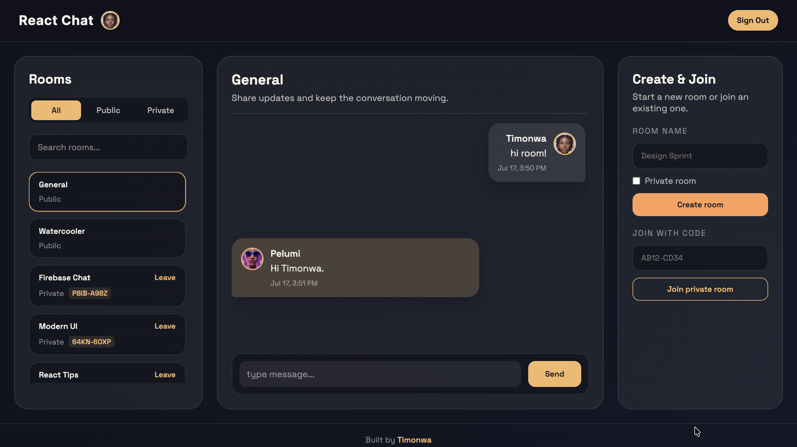

# Create a Multi-Room Chat App Using React and Firebase

Starter code for the tutorial on building a real-time chat app with React and Firebase. The UI is already built — you'll follow the guide to wire up Firebase Authentication, a room-based Firestore data model, and real-time messaging yourself.



> **📌 You're on the `setup` branch — the starter code**
>
> This is the code you follow along with in the tutorial. The layout, components, and styles are in place, but **Firebase isn't wired up yet** — the app runs on local sample data and a fake signed-in state. Build the real thing step by step by following the guide:
>
> **👉 [Create a Multi-Room Chat App Using React and Firebase](https://tech.timonwa.com/blog/create-multi-room-chat-app-using-react-firebase)**
>
> Prefer the finished result? The completed code lives on the [`main` branch](https://github.com/Timonwa/react-chat), and there's a [live demo](https://react-chat-timonwa.vercel.app/).
>
> ⭐ If this helped, please star the repo.

## Table of Contents

- [What You'll Build](#what-youll-build)
- [Tech Stack](#tech-stack)
- [Prerequisites](#prerequisites)
- [Getting Started](#getting-started)
- [Author](#author)
- [License](#license)
- [Additional Resources](#additional-resources)

## What You'll Build

Starting from this UI, the tutorial walks you through adding:

- **Google authentication** with Firebase Auth (replacing the fake signed-in state)
- **Real-time messaging** backed by Cloud Firestore (replacing the local sample data)
- **A room-based Firestore schema** for public and private rooms
- **Public and private rooms** with shareable join codes
- **Room search and tabs** for filtering public vs private rooms
- **Message timestamps and avatars** with fallbacks

Already in place for you: the responsive three-panel layout (rooms, chat, create & join), all components and styling, and the drawer behavior on small screens.

## Tech Stack

- **[React](https://react.dev/)** – UI library (Create React App)
- **[Firebase](https://firebase.google.com/)** – Authentication + Cloud Firestore
- **[React Firebase Hooks](https://github.com/CSFrequency/react-firebase-hooks)** – auth state helpers
- **JavaScript** – ES2020+ syntax

## Prerequisites

- Node.js 18+ (or newer)
- A [Firebase project](https://console.firebase.google.com/) with **Authentication** (Google provider) and **Cloud Firestore** enabled

## Getting Started

1. Clone the repository and switch to this branch:

   ```bash
   git clone https://github.com/Timonwa/react-chat.git
   cd react-chat
   git checkout setup
   ```

2. Install dependencies:

   ```bash
   npm install
   ```

3. Create your environment file:

   ```bash
   cp .env.example .env
   ```

   You'll add your Firebase web app config as you follow the tutorial. Find these values in the Firebase console under **Project settings → General → Your apps**.

   | Variable | Required | Description |
   | --- | --- | --- |
   | `REACT_APP_API_KEY` | Yes | Firebase web API key |
   | `REACT_APP_AUTH_DOMAIN` | Yes | Firebase auth domain (`your_project_id.firebaseapp.com`) |
   | `REACT_APP_PROJECT_ID` | Yes | Firebase project ID |
   | `REACT_APP_STORAGE_BUCKET` | Yes | Firebase storage bucket |
   | `REACT_APP_MESSAGING_SENDER_ID` | Yes | Firebase Cloud Messaging sender ID |
   | `REACT_APP_APP_ID` | Yes | Firebase app ID |
   | `REACT_APP_MEASUREMENT_ID` | No | Google Analytics measurement ID (optional) |

4. Start the development server:

   ```bash
   npm start
   ```

   The app runs at [http://localhost:3000](http://localhost:3000) on sample data. Follow the tutorial to make it real.

## Author

Built by **Timonwa Akintokun**.

- 📝 More tutorials on my blog: **[tech.timonwa.com/blog](https://tech.timonwa.com/blog)**
- 🔗 All my links & socials: **[links.timonwa.com](https://links.timonwa.com)**
- 💻 GitHub: **[@Timonwa](https://github.com/Timonwa)**

## License

This project is licensed under the MIT License – see the [LICENSE](LICENSE.MD) file for details.

## Additional Resources

- 📝 [Create a Multi-Room Chat App Using React and Firebase](https://tech.timonwa.com/blog/create-multi-room-chat-app-using-react-firebase) — the full tutorial
- 📜 [Original Tutorial (2023)](https://tech.timonwa.com/blog/building-a-real-time-chat-app-with-reactjs-and-firebase) – originally published on [freeCodeCamp](https://www.freecodecamp.org/news/building-a-real-time-chat-app-with-reactjs-and-firebase/)
- 📚 [More tutorials on my blog](https://tech.timonwa.com/blog)
- 🔗 [Connect with me](https://links.timonwa.com)
- 📖 [Firebase Documentation](https://firebase.google.com/docs)
